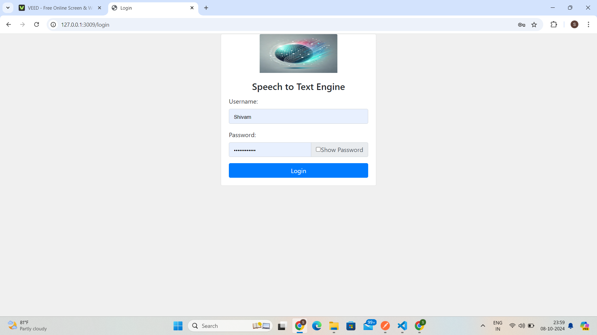
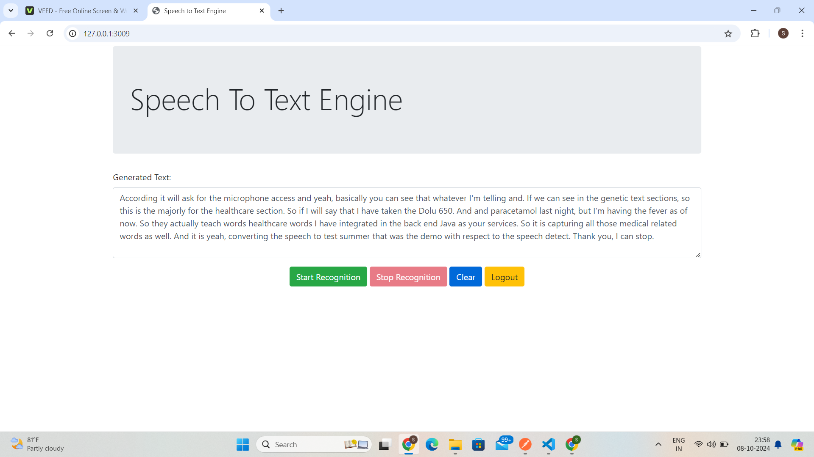

# Speech-to-Text Conversion Using Azure for Healthcare Domain

## Project Overview
This project leverages **Azure's Speech-to-Text** service, tailored specifically for the **healthcare domain**. It aims to provide accurate and real-time transcription of spoken language into text, especially in medical contexts like **medical transcription**, **voice commands**, or **note-taking for healthcare professionals**.

### Key Features:
1. **Azure Speech-to-Text Service**  
   Azure offers a robust service for converting speech into text. This functionality is crucial in scenarios where voice input needs to be processed quickly and accurately, such as in medical consultations or during note-taking by doctors.

2. **Customized Vocabulary for Healthcare**  
   In healthcare, there are numerous specialized terms, such as **medical conditions**, **drug names**, and **procedures**, which might not be recognized by a standard speech-to-text system.  
   We have integrated **custom vocabulary** into Azure's Speech-to-Text API, allowing the system to accurately recognize and transcribe these medical terms.

3. **Production Deployment**  
   The system is deployed in a **production environment**, which means it is live and ready for use in real-time applications.  
   Access to the service requires the following credentials:
   - **Subscription Key**: A key that grants access to Azure services.
   - **Endpoint ID**: Identifies the specific Azure Speech-to-Text service deployed.
   - **Region**: The region where the Azure service is hosted, ensuring optimal performance.

4. **Real-time Integration with Python and JavaScript**  
   The Azure service is integrated into both **Python** and **JavaScript** applications, enabling real-time text conversion.  
   - In **Python**, healthcare professionals can dictate notes, and the text will be generated instantly.
   - In **JavaScript**, users can interact with a web application, where their speech is transcribed in real-time as they speak.

5. **Real-time Usage**  
   This system is optimized for **real-time speech processing**, ensuring that transcriptions are provided instantly. This is particularly useful in healthcare scenarios like medical consultations or surgeries, where fast and accurate transcription is essential.

### Key Components:
- **Azure Speech-to-Text API**: Converts speech into text.
- **Healthcare-specific Vocabulary**: Custom vocabulary tailored for medical terminology.
- **Production Deployment**: The system is live, with secure access credentials.
- **Real-time Integration**: Python and JavaScript applications provide real-time transcription.

## Benefits for Healthcare
This project assists **healthcare professionals** by providing an **efficient** and **accurate** way to convert speech into text, particularly using specialized **medical vocabulary**. This can improve the speed and accuracy of documentation, making healthcare workflows more efficient.

---

---

---
### How to Use:
1. **Setup Azure Speech-to-Text API**  
   Obtain your **Subscription Key**, **Endpoint ID**, and ensure you are using the correct **Region**.
   
2. **Run the Python or JavaScript Integration**  
   - For Python, use the provided script to interact with the API and convert speech into text.
   - For JavaScript, use the web application to capture and transcribe speech in real-time.

3. **Customize the Vocabulary**  
   Customize the vocabulary by adding specific medical terms to ensure high accuracy for healthcare-related transcriptions.

---

### License
This project is licensed under the MIT License.
